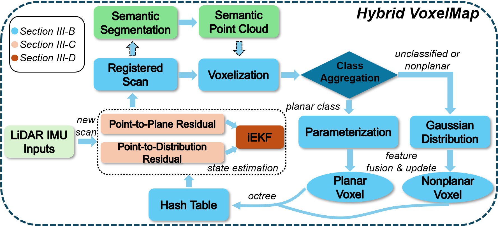
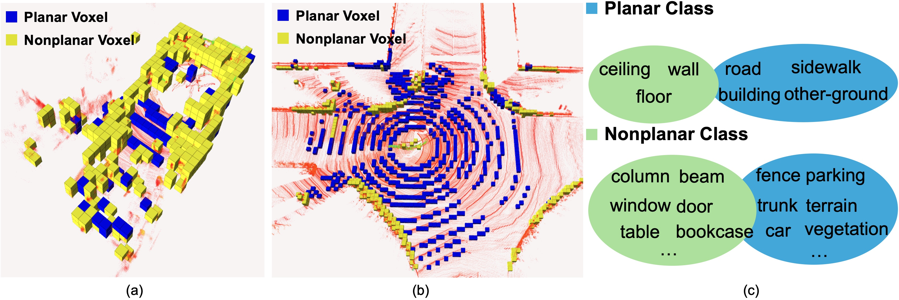

# Hybrid-VoxelMap

<div align="center">
    
</div>

**Hybrid-VoxelMap** improves upon VoxelMap / VoxelMap++ with three key contributions:

1. We propose a semantic-driven hybrid voxel representation that models each voxel as either a plane or a Gaussian based on semantic labels.
2. We develop a scale-consistent scan-matching method that unifies geometric and probabilistic constraints for robust registration.
3. We demonstrate real-time performance and significant accuracy gains across UGV, UAV, and handheld platforms in diverse environments.

<div align="center">
    
</div>
<div align="center">
    
</div>

### Related paper
Related paper available on:  
[Gaussian or Plane? Both: Semantic-Driven Voxel Representation for LiDAR–Inertial Odometry](https://ieeexplore.ieee.org/document/11247866)

## 1. Prerequisites
### 1.1. **PCL && Eigen**

PCL>= 1.8,   Follow [PCL Installation](http://www.pointclouds.org/downloads/linux.html).

Eigen>= 3.3.4, Follow [Eigen Installation](http://eigen.tuxfamily.org/index.php?title=Main_Page).

### 1.2. **livox_ros_driver**
Follow [livox_ros_driver Installation](https://github.com/Livox-SDK/livox_ros_driver).

### 1.3.  ROS

We have tested our implementation only on Ubuntu 20 and ROS Noetic.

## 2. Build
Clone the repository and catkin_make:
```
    cd ~/$A_ROS_DIR$/src
    git clone https://github.com/haiyang2022/Hybrid-VoxelMap.git
    cd ..
    catkin_make
    source devel/setup.bash
```
## 3. Configuring RandLA-Net

### 3.1 Preparation

We use [RandLA-Net-Pytorch](https://github.com/liuxuexun/RandLA-Net-Pytorch-New) for semantic segmentation. Please follow the setup instructions provided in that repository and download the two available pretrained models (S3DIS(Area5) and SemanticKITTI).

**Note:** Please create an `output/` folder in the `RandLA-Net-Pytorch` directory to store the two pretrained models.

### 3.2 Run the inference script

Move `Inf_scan_ros.py` from our repository’s `/RandLA-Net/` folder into the `RandLA-Net-Pytorch` directory, then run:

```
python Inf_scan_ros.py --gpu=0 --scene=outdoor --mapsize=0.5	# for indoor: --scene=indoor
```

## 4. Run on Dataset

### 4.1 Run on [M2DGR](https://github.com/SJTU-ViSYS/M2DGR) dataset
```
    source devel/setup.bash
    roslaunch hybrid_voxel_map mapping_m2dgr.launch
```

### 4.2 Run on [NTU-VIRAL](https://ntu-aris.github.io/ntu_viral_dataset/) dataset

```
    source devel/setup.bash
    roslaunch hybrid_voxel_map mapping_ntuviral.launch
```

**Note:**

- Start the `hybrid_voxel_map` node first, then run `Inf_scan_ros.py`, and finally play the rosbag.
- Please create the following folder or modify the corresponding path in `voxelMapping.cpp` to save the TUM-format poses to:
   `"/Downloads/HybridVM_result/"`
- Our algorithm mainly depends on three parameters: `down_sample_size`, `max_distance`, and `init_plane_threshold`. We provide recommended values for these parameters in the corresponding YAML files for both datasets—especially for the M2DGR dataset. Please follow our suggested settings when selecting the appropriate parameters; there is no need to modify any other parameters.
- The `voxel_size` should match the value used in RandLA-Net; therefore, please do not modify this parameter.

## 5.Acknowledgments
- Our implementation is built upon[VoxelMap++](https://github.com/uestc-icsp/VoxelMapPlus_Public), and we thank the authors for their contribution. We also extend our thanks to[VoxelMap](https://github.com/hku-mars/VoxelMap/tree/master).

- We use a pre-trained RandLA-Net model for semantic segmentation. We would like to express our special thanks to [RandLA-Net-Pytorch](https://github.com/liuxuexun/RandLA-Net-Pytorch-New) for providing the PyTorch implementation and the pre-trained weights, which we use in our work.

